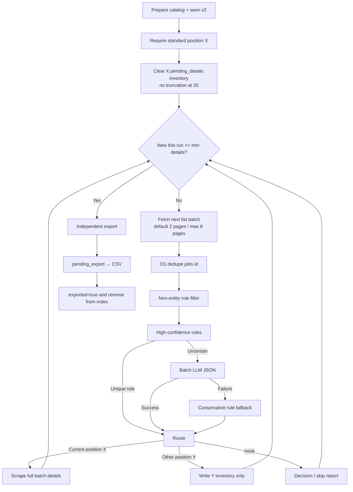

# BOSS Zhipin Scraper · Job Crawler v2.5 (Chrome CDP / Skillver CSV)

> 🌐 中文文档：[README.md](./README.md)


A lightweight **BOSS Zhipin scraper**: connect to your already-logged-in local Chrome via CDP, scrape by **Skillver standard position** in split steps; **Agent built-in model** classifies jobs (`references/classify-decisions.md`), then details export to `job_YYYYMMDD.csv`, with USCC / legal name via **Agent web search + human confirmation**. Minimal Agent Skill: `SKILL.md`.

> 📌 **In one sentence**: CDP → list → Agent classify → details → Skillver CSV; USCC via Agent search + human review — no Qichacha, no in-script DeepSeek.

---

## ⚠️ Disclaimer

This project is for **learning and technical research purposes only**. It is intended to explore Chrome DevTools Protocol, front-end anti-scraping mechanisms, and data-collection techniques. Do **not** use it for any purpose that violates the [BOSS Zhipin Terms of Service](https://www.zhipin.com/about/protocol.html) or applicable laws and regulations, including commercial resale, malicious scraping, or any activity that imposes undue load on the target site. Users are solely responsible for the consequences of using this project; the author is not liable for any misuse.

---

## 🚀 30-Second Quick Start

```bash
# 1. Clone + install deps
git clone https://github.com/eatmoreduck/boss-zhipin-scraper.git
cd boss-zhipin-scraper
pip install -r requirements.txt          # or: uv sync

# 2. Launch an isolated Chrome and log in (only once; session persists)
python3 scripts/boss_cdp_raw.py --setup-chrome

# 3. Standard-position split flow (full Agent loop in SKILL.md)
python3 scripts/boss_cdp_raw.py --position-name "Agent工程师" --drain-inventory
python3 scripts/boss_cdp_raw.py \
  --position-name "Agent工程师" --city 上海 --list-only --list-start-page 1
# After Agent writes decisions per references/classify-decisions.md:
python3 scripts/boss_cdp_raw.py \
  --position-name "Agent工程师" \
  --classify-input data/skillver/exports/classify_input_Agent工程师_1.json \
  --details-from-decisions data/skillver/exports/classify_decisions_Agent工程师_1.json

# 4. Export Skillver CSV
python3 scripts/export_skillver_csv.py \
  --details data/skillver/details/boss_details_Agent工程师.json \
  --position-name "Agent工程师"

# List supported cities: --list-cities [keyword]
python3 scripts/boss_cdp_raw.py --list-cities 江
```

Full Agent Skill human-in-the-loop flow (login gate / USCC search / CSV review) is in [`SKILL.md`](./SKILL.md).

## ✨ Features

- Plaintext salary (API mode, bypasses font-based obfuscation)
- Skillver standard-position main path (`--position-name` + catalog)
- Detail-page JD scraping; export `job_YYYYMMDD.csv` (with USCC / legal-name columns)
- USCC: Agent web search + `company_uscc_cache.json` (written after human review)
- Incremental writes (no data loss on crash)
- One-shot environment check + persistent isolated Chrome CDP profile
- Multi-dimension filters (scale, funding, salary, experience, degree, industry)
- macOS / Linux / Windows (Windows needs local Chrome + a debug port)

<details>
<summary>🔍 Why not a Selenium / Playwright crawler?</summary>

- Selenium/Playwright spins up a full instrumented browser — it's heavy, has an obvious fingerprint, and is easily flagged by BOSS Zhipin's risk-control / CAPTCHA.
- This tool connects to your own already-logged-in Chrome (via CDP), reusing a real fingerprint and session, and calls the same legitimate search API the page uses. The `salaryDesc` it returns is already plaintext — no need to parse font-obfuscated DOM salaries.
- The result is more stable than traditional DOM-scraping crawlers and harder to flag as automated traffic.

</details>

## Installation

### Option 1: Clone then install locally (recommended)

Because `hermes skills install` may not reach GitHub directly in some environments, clone the repo first and install locally:

```bash
# 1. Clone the repo
git clone https://github.com/eatmoreduck/boss-zhipin-scraper.git
cd boss-zhipin-scraper

# 2. Copy into the Hermes skills directory (minimal set)
SKILL_ROOT=~/.hermes/skills/data-science/boss-zhipin-scraper
mkdir -p "$SKILL_ROOT/scripts" "$SKILL_ROOT/data/skillver" "$SKILL_ROOT/references"
cp SKILL.md "$SKILL_ROOT/"
cp requirements.txt "$SKILL_ROOT/"
cp scripts/boss_cdp_raw.py scripts/export_skillver_csv.py "$SKILL_ROOT/scripts/"
cp data/city_codes.json "$SKILL_ROOT/data/"
cp data/skillver/position_catalog.json "$SKILL_ROOT/data/skillver/"
cp references/classify-decisions.md "$SKILL_ROOT/references/"
```

### Option 2: One-line curl install

No need to clone the whole repo — download just the files you need:

```bash
SKILL_ROOT=~/.hermes/skills/data-science/boss-zhipin-scraper
mkdir -p "$SKILL_ROOT/scripts" "$SKILL_ROOT/data/skillver" && \
curl -sL https://raw.githubusercontent.com/eatmoreduck/boss-zhipin-scraper/master/SKILL.md \
  -o "$SKILL_ROOT/SKILL.md" && \
curl -sL https://raw.githubusercontent.com/eatmoreduck/boss-zhipin-scraper/master/scripts/boss_cdp_raw.py \
  -o "$SKILL_ROOT/scripts/boss_cdp_raw.py" && \
curl -sL https://raw.githubusercontent.com/eatmoreduck/boss-zhipin-scraper/master/scripts/export_skillver_csv.py \
  -o "$SKILL_ROOT/scripts/export_skillver_csv.py" && \
curl -sL https://raw.githubusercontent.com/eatmoreduck/boss-zhipin-scraper/master/data/city_codes.json \
  -o "$SKILL_ROOT/data/city_codes.json" && \
curl -sL https://raw.githubusercontent.com/eatmoreduck/boss-zhipin-scraper/master/data/skillver/position_catalog.json \
  -o "$SKILL_ROOT/data/skillver/position_catalog.json"
```

### Option 3: `hermes skills install` (requires direct GitHub access)

```bash
hermes skills install https://raw.githubusercontent.com/eatmoreduck/boss-zhipin-scraper/master/SKILL.md --category data-science
```

> Note: this depends on the hermes process being able to reach GitHub directly. If you hit a timeout or connection failure, use Option 1 or 2.

### Verify the installation

```bash
# Check that the files exist
ls ~/.hermes/skills/data-science/boss-zhipin-scraper/SKILL.md
ls ~/.hermes/skills/data-science/boss-zhipin-scraper/scripts/boss_cdp_raw.py
ls ~/.hermes/skills/data-science/boss-zhipin-scraper/scripts/export_skillver_csv.py
ls ~/.hermes/skills/data-science/boss-zhipin-scraper/data/city_codes.json
ls ~/.hermes/skills/data-science/boss-zhipin-scraper/data/skillver/position_catalog.json
```

After installing, say in an Agent conversation: "Scrape BOSS Shanghai Agent工程师 by standard position and export Skillver CSV" (follow the human gates in `SKILL.md`).

## Use as a CLI tool

You don't have to install it as a Skill — use it as a plain CLI:

```bash
# 1. Clone + install deps
git clone https://github.com/eatmoreduck/boss-zhipin-scraper.git
cd boss-zhipin-scraper
pip install -r requirements.txt

# 2. Start Chrome CDP
python3 scripts/boss_cdp_raw.py --setup-chrome
# First run won't copy your main Chrome session; log in to zhipin.com in the dedicated BOSS browser that pops up
# setup waits for login to finish and confirms the API returns plaintext salaries

# 3. Check the environment
python3 scripts/boss_cdp_raw.py --check

# Optional: real browser/API smoke test (writes no result files)
python3 scripts/boss_cdp_raw.py --smoke-test

# 4. Scrape by standard position (required --position-name)
python3 scripts/boss_cdp_raw.py \
  --position-name "预训练算法研究员/工程师" \
  --city 上海 --pages 3

# 5. Export Skillver CSV
python3 scripts/export_skillver_csv.py \
  --details data/skillver/details/boss_details_预训练算法研究员_工程师.json \
  --position-name "预训练算法研究员/工程师"
```

## Parameters


| Parameter | Description |
|-----------|-------------|
| `--position-name` | **Main path (required)**: must match `data/skillver/position_catalog.json`; used as the BOSS search keyword; defaults to `data/skillver/jobs/` and `details/` |
| `--catalog` | Catalog path (default `data/skillver/position_catalog.json`) |
| `--seen` | Skillver `seen_jobs.json` (default `data/skillver/seen_jobs.json`; on detail success writes `has_details=true, exported=false`) |
| `--keyword` | [legacy] free-form keyword; use `--position-name` for the main path |
| `--city` | City (Chinese name or 9-digit code, default Shanghai). **Supports cities nationwide** (300+, incl. tier-3/4/5); city codes auto-sync from BOSS at runtime. See [`data/city_codes.json`](data/city_codes.json), or run `--list-cities`. An unrecognized city name exits with an error instead of silently producing zero results |
| `--list-cities [keyword]` | Print the supported city list, optional keyword filter, e.g. `--list-cities 江` |
| `--pages` | Number of pages (standard-position mode max 3; global max 10) |
| `--format` | json / csv; csv also exports list and detail CSVs |
| `--detail` | Scrape detail-page JD (on by default); headhunter / HR-agency list cards are filtered out before applying `--max-details` (the list JSON still keeps the raw results) |
| `--no-detail` | Do not scrape detail pages |
| `--max-details N` | Scrape at most N detail pages (standard-position default 20; after match/entity or headhunter filter, and skipping already-scraped details) |
| `--match-report` | Standard-position match/entity skip report JSON (default `data/skillver/exports/match_skip_<name>.json`) |
| `--title-include` / `--title-exclude` / `--title-filter-pm` | [legacy] title filters; **ignored in standard-position mode** (LLM/rule match instead) |
| `--keywords-file FILE` | [legacy] batch keywords JSON; **removed from main path** — use `--position-name` |
| `--output-dir DIR` | [legacy] batch output directory |
| `--position-gap SEC` | [legacy] inter-keyword wait |
| `--seen-details-dir DIR` | Extra scan of detail JSON for `encrypt_job_id` dedupe (standard-position mode still prefers `seen_jobs.json`) |
| `--analysis` | Analysis report |
| `--merge FILE` | Merge existing data (deduped by job_id) |
| `--allow-dom-fallback` | Allow DOM extraction fallback when the API has no data; off by default, salaries may be unreliable |
| `--check` | Environment check (CDP + deps + login state) |
| `--smoke-test` | Run one real Chrome/CDP BOSS search API smoke test, writes no result files |
| `--setup-chrome` | One-shot launch of Chrome CDP (persistent isolated profile) |
| `--copy-login-state` | Manually import the main Chrome's Local State + cookie-related files into the isolated profile (never copied by default, on first run, or on repeated runs) |
| `--reset-chrome-profile` | Rebuild the dedicated BOSS Chrome profile; clears the login state inside this dedicated browser |
| `--no-wait-login` | With `--setup-chrome`, do not wait for login to finish |
| `--login-timeout` | Seconds to wait for login under `--setup-chrome` (default 300) |
| `--stop-chrome` | Close the dedicated BOSS CDP Chrome (matched precisely by the isolated profile; never touches your main Chrome) |
| `--close-chrome` | Auto-close the dedicated Chrome after a scrape finishes normally (off by default; not triggered on errors, so the login state is kept) |
| `--output` | List output path (default `~/.boss-zhipin-scraper/job-result/`) |
| `--detail-output` | Detail output path (default `~/.boss-zhipin-scraper/job-result/`) |
| `--cdp-port` | CDP port (default 9222) |
| `--scale/--salary/--experience/--degree` | Filters |


## Skillver Standard-Position Pipeline

For Skillver `job_YYYYMMDD.csv`. Agent orchestration is in [`SKILL.md`](./SKILL.md) (human gates: login / USCC / CSV review).

**2.5.0 main path**: catalog, export, seen v2, split CLI (drain / list-only / details-from-decisions), **Agent built-in model classification** (`references/classify-decisions.md`), multi-select filters. USCC / legal name via **Agent web search + human confirmation**, then **in-place CSV backfill**. `--keywords-file` is **legacy**. No DeepSeek `.env`.

Main chain:

```text
Clear inventory
→ 2-page list batch
→ O(1) dedupe
→ non-entity rule filter
→ high-confidence rule classify
→ batch LLM
→ conservative fallback
→ current-position details / other-position inventory / none
→ decide after batch details
→ max 8 pages
→ independent export
```

Standard-position scrape example (defaults `--min-details 20`, `--page-batch-size 2`, `--pages` capped at 8):

```bash
python3 scripts/boss_cdp_raw.py \
  --position-name "预训练算法研究员/工程师" \
  --city 上海 \
  --pages 8 \
  --min-details 20 \
  --page-batch-size 2 \
  --experience 101,102 \
  --scale 305 --scale 306
```

Export example (pulls from `pending_export`; three position columns from catalog; default filename is dated):

```bash
python3 scripts/export_skillver_csv.py \
  --details data/skillver/details/xxx.json \
  --position-name "预训练算法研究员/工程师" \
  --seen data/skillver/seen_jobs.json \
  --city 上海 \
  --append
# default output: data/skillver/exports/job_YYYYMMDD.csv
```

Fill unified social credit code + legal company name:

1. After export, list `招聘品牌名` rows in the CSV that are missing USCC
2. Use **Agent web search** on public sources for candidate `uscc` / `legal_name` (confirm ambiguous cases with a human)
3. Write `data/skillver/company_uscc_cache.json` (`by_brand` + `by_uscc`; brand keys must match the CSV exactly)
4. Backfill CSV `企业名称` / `统一社会信用代码`; keep the BOSS display name in `招聘品牌名`

Backend should treat **USCC** as the company primary key. Full steps: `SKILL.md` Steps 6–7.

After a successful row write, the job is marked `exported=true` keyed by `encrypt_job_id` and removed from `pending_export`; `--dry-run` writes neither CSV nor seen. After packaging you can also run: `uv run boss-export-skillver --details ...`.

Export is tuned for Skillver’s comma-split-then-rejoin CSV parser: ASCII commas inside JD become full-width `，`, quotes are stripped, rows are deduped by entity (prefer USCC) + position name, and obvious HR/sales mislabels plus salary low-end `<10K` are skipped.

### Core rules

1. **A standard position is required**; canonical asset: `data/skillver/position_catalog.json` (58 roles). Formal `position_name` must be the exact catalog name.
2. After choosing position X, three CSV columns are fixed: intent id / intent label / position name. Never write CSV position fields from BOSS `title` or LLM-invented names.
3. Within-batch classification order: `jobs[id]` O(1) dedupe → obvious headhunter/HR/anonymous rule filter (before classification LLM) → high-confidence rule unique classify → uncertain items batch LLM (JSON output only) → on failure conservative rule fallback → route to current position X / other position Y / none.
4. **`--min-details` is the target number of NEW details this run** (default 20), not “stop because historical totals already reach N”: count only newly successful details in the current run; inventory and current-batch details are fully attempted without truncation; once this run’s new-count meets the target, no new list pages are fetched.
5. List pages default to **2 pages per batch** (`--page-batch-size`); standard-position search budget / hard cap is **8 pages** (`--pages`).
6. One `seen_jobs.json` (version 2): `jobs` is the single source of truth; `by_position[X].pending_details/pending_export` are todo indexes (no `done`). Other position Y is inventory-only — scraping X does not crawl Y details.
7. Outputs live under `data/skillver/` (`jobs/` / `details/` / `exports/` / `eval/` / USCC cache).
8. Export is a separate script (`export_skillver_csv.py` → `job_YYYYMMDD.csv`); USCC is applied from cache; each run may write a full decision report and human-review CSV (`eval/review_<run_id>.csv`).

### Standard-position design table (58)

Same as `data/skillver/position_catalog.json`. AI 36 + robotics 22.

#### AI (36)

| job_intent_id | job_intent_label | position_name |
|---|---|---|
| J01 | AI 算法工程师 | 机器学习工程师 |
| J01 | AI 算法工程师 | CV算法工程师 |
| J01 | AI 算法工程师 | 智能搜索/推荐工程师 |
| J02 | AI 大模型工程师 | 预训练算法研究员/工程师 |
| J02 | AI 大模型工程师 | 后训练与对齐工程师 |
| J02 | AI 大模型工程师 | 推理优化工程师(算法层) |
| J02 | AI 大模型工程师 | 模型架构研究员 |
| J02 | AI 大模型工程师 | 大模型评测与合成数据专家 |
| J03 | AI 应用开发工程师 | AI应用工程师 |
| J03 | AI 应用开发工程师 | Agent工程师 |
| J04 | AI 多模态工程师 | 多模态/AIGC算法工程师 |
| J04 | AI 多模态工程师 | 视频/数字人生成工程师 |
| J04 | AI 多模态工程师 | 语音AI工程师(含合成) |
| J05 | AI 数据工程师 | AI数据工程师(管道/治理) |
| J05 | AI 数据工程师 | AI数据质量工程师 |
| J05 | AI 数据工程师 | AI知识工程师 |
| J06 | AI 基础设施 / MLOps | MLOps/LLMOps工程师 |
| J06 | AI 基础设施 / MLOps | 推理部署工程师(工程层) |
| J06 | AI 基础设施 / MLOps | AI平台工程师 |
| J06 | AI 基础设施 / MLOps | GPU/算力调度工程师 |
| J06 | AI 基础设施 / MLOps | AI数据基建/特征平台 |
| J06 | AI 基础设施 / MLOps | AI成本工程师(FinOps) |
| J08 | AI 安全 / 合规工程师 | AI安全架构师 |
| J08 | AI 安全 / 合规工程师 | 模型安全红队/对抗检测 |
| J08 | AI 安全 / 合规工程师 | AI治理/合规与风险 |
| J09 | AI 产品经理 | AI产品经理(平台/商业) |
| J09 | AI 产品经理 | 对话式/Agent产品经理 |
| J09 | AI 产品经理 | AI业务分析师 |
| J10 | AI 解决方案 / 售前 | AI解决方案架构师 |
| J10 | AI 解决方案 / 售前 | AI售前工程师 |
| J10 | AI 解决方案 / 售前 | AI交付/前向部署工程师 |
| J11 | AI 商业化 / 运营 / 销售 | AI商务拓展经理(含客户成功) |
| J11 | AI 商业化 / 运营 / 销售 | AI增长/市场营销经理 |
| J99 | 其他 / 跨方向 | AI研究员/科学家 |
| J99 | 其他 / 跨方向 | AI技术项目经理 |
| J99 | 其他 / 跨方向 | AI自动化架构师 |

#### Robotics (J07, 22)

All use `job_intent_id=J07`, `job_intent_label=机器人 / 具身智能工程师`:

| position_name |
|---|
| 具身智能算法工程师 |
| 机器人感知算法工程师 |
| 机器人导航规划工程师 |
| 机器人运动控制工程师 |
| 具身智能硬件工程师 |
| 机器人产品经理 |
| 机器人系统架构师 |
| 机器人解决方案工程师 |
| 机器人项目经理 |
| 具身智能研究工程师 |
| 机器人AI产品工程师 |
| 机器人数据工程师 |
| 机器人基础平台工程师 |
| 伺服驱动工程师 |
| 机器人安全系统工程师 |
| 机械臂结构设计工程师 |
| 机器人仿真与迁移工程师 |
| 机器人验证测试工程师 |
| 机器人执行器工程师 |
| 机器人视觉传感器工程师 |
| 灵巧手工程师 |
| 触觉/力觉传感器工程师 |

### Flowchart



### Directory layout

```
data/skillver/
├── position_catalog.json      # committed: only standard-position asset
├── seen_jobs.json             # local: version 2 (jobs + by_position)
├── company_uscc_cache.json    # local: brand ↔ USCC / legal name
├── jobs/                      # local: list JSON
├── details/                   # local: detail JSON
├── exports/                   # local: job_YYYYMMDD.csv / decision reports
├── uscc_screenshots/          # local: optional enrich screenshots
└── eval/                      # local: review_*.csv / gold_labels.jsonl / metrics_*.json
```

### `seen` states (version 2)

| State | Meaning | Behavior |
| --- | --- | --- |
| Not in `jobs` | Never seen | After classification, may be written and enter that position's `pending_details` |
| `has_details=false` | Classified, no details yet | In `by_position[X].pending_details`; clearing inventory when running X |
| `has_details=true` and `exported=false` | Details scraped, not exported | In `pending_export`; removed after successful export |
| `exported=true` | Exported | Not in todo queues; export skips |


## File Structure

```
boss-zhipin-scraper/
├── SKILL.md                         # Minimal Agent Skill handbook (human-in-the-loop)
├── README.md
├── CHANGELOG.md
├── LICENSE
├── pyproject.toml
├── .env.example                     # Optional DeepSeek for standard-position classification LLM
├── data/
│   ├── city_codes.json              # Full city-code map
│   └── skillver/                    # Standard-position catalog + local outputs / USCC cache
├── scripts/
│   ├── boss_cdp_raw.py              # Main scrape script
│   └── export_skillver_csv.py       # Details → job_YYYYMMDD.csv + seen / USCC cache
├── tests/
└── requirements.txt
```

## How It Works

This is a Chrome-CDP-based BOSS Zhipin crawler. Core flow:

1. Connect to an already-open Chrome via the Chrome DevTools Protocol (CDP)
2. Inject JS inside the BOSS Zhipin page that calls the search API via synchronous XHR
3. The API returns plaintext `salaryDesc`, bypassing the front-end font obfuscation
4. The list API preserves `securityId` / `lid` context, carried into the detail page
5. Each page is written to disk immediately, deduped by `job_id`

DOM extraction is not used for the list by default, since DOM salaries may be hit by font-based obfuscation. Only when `--allow-dom-fallback` is explicitly passed will it fall back to DOM when the API returns no data.

For detail pages, the scraper only extracts a section containing the job-description heading. Full-page `body` text is diagnostic input for detecting login walls and navigation shells and is never written directly as a JD. If the page contains the login-to-view-full-content marker, the crawl fails explicitly and stops before truncated text, recruiter metadata, company sections, or recommended jobs can be saved as a complete JD. Standard-position mode (P6): clear `pending_details` inventory first, then per default 2-page batch run O(1) dedupe / non-entity rules / high-confidence rules / batch LLM / conservative fallback, routing to current-position details, other-position inventory, or none; `--min-details` defaults to 20 (new details this run, not a hard cap), `--pages` defaults to max 8 pages. Dedupe uses `seen_jobs.json` `jobs[id]`. Successful details bind `position_name` / `job_intent_id` / `job_intent_label` and update seen (enter `pending_export`).

Re-detail an existing list (still requires `--position-name` for binding / seen):

```bash
python3 scripts/boss_cdp_raw.py \
  --position-name "AI产品经理(平台/商业)" \
  --input data/skillver/jobs/boss_jobs_xxx.json \
  --min-details 50 \
  --detail-output data/skillver/details/boss_details_xxx.json
```

Batch keywords (**legacy; CLI rejects** — use `--position-name` per role).

`--input ... --analysis --no-detail` first loads `--detail-output`, then the `boss_details_*.json` with the same timestamp in the same dir as the input list, and finally the newest detail file under `~/.boss-zhipin-scraper/job-result`.

## Chrome Profile Security Policy

`--setup-chrome` uses a persistent isolated profile by default — it neither symlinks nor copies your main Chrome data. First launch and subsequent launches only create or reuse this dedicated profile:

- `~/.boss-zhipin-scraper/chrome-profile`

Without an explicit `--output` / `--detail-output`, the standard-position main path saves under:

- `data/skillver/jobs/boss_jobs_<name>.json`
- `data/skillver/details/boss_details_<name>.json`

(Other non-standard-position tooling may still use `~/.boss-zhipin-scraper/job-result`.)

On first use you must log in to BOSS Zhipin manually inside this dedicated Chrome. `--setup-chrome` waits for the login to finish and uses the search API to confirm it can get plaintext `salaryDesc` before returning. The session is stored inside the dedicated profile and survives reboots; re-running `--setup-chrome` does not wipe it and does not affect your main Chrome, Gmail, GitHub, or other accounts.

Each login-probe round sends one search request, rotates across keyword/city targets, and backs off from 3 seconds to at most 15 seconds. Probe requests count toward the same 500-request global budget. Logged-out sessions, empty probe samples, API restrictions, and malformed responses are reported separately. A confirmed restriction such as `code: 31` or `code: 37` ("您的环境存在异常" / abnormal environment) stops probing immediately instead of prompting for another login or continuing frequent retries. Unknown risk-control codes are also recognized as restrictions via message keywords (abnormal environment, too-frequent access, security check, etc.), so an authenticated session that is merely rate-limited is no longer misreported as a login failure.

The interactive login page opened by `--setup-chrome` is the only temporary page intentionally brought to the foreground. Temporary tabs used by environment checks, list/detail scraping, and the smoke test run in the background so automation does not repeatedly steal focus. “Background” here only means the tab is not activated; the dedicated Chrome still runs with a visible UI and can be opened manually for inspection.

If you really need to import the BOSS session from your main Chrome, run explicitly:

```bash
python3 scripts/boss_cdp_raw.py --setup-chrome --copy-login-state
```

`--copy-login-state` overwrites the corresponding cookie-related files inside the isolated profile on every run; do not pass this for daily launches. It only copies `Local State` and `Default/Cookies*`, `Default/Network/Cookies*`-style cookie database files — not password stores, history, extensions, or a full profile. To wipe the dedicated browser's login state:

```bash
python3 scripts/boss_cdp_raw.py --setup-chrome --reset-chrome-profile
```

### Tearing down when you're done

After a scrape/analysis finishes, the dedicated Chrome is **not** closed automatically (the login state is kept by default so you can run the next scrape right away). When you're sure you no longer need it, tear it down manually:

```bash
python3 scripts/boss_cdp_raw.py --stop-chrome
```

`--stop-chrome` only closes the Chrome process(es) that belong to the scraper's isolated profile (`--user-data-dir`). It **never** kills by port or process name, so it cannot accidentally take down your main Chrome, Gmail, GitHub, or other signed-in sessions.

If you'd rather have a particular scrape close the dedicated Chrome once it finishes normally, add `--close-chrome`:

```bash
python3 scripts/boss_cdp_raw.py \
  --position-name "预训练算法研究员/工程师" \
  --city 上海 --pages 3 --close-chrome
```

`--close-chrome` is off by default, and it only fires on the **success path** of a completed scrape — login failures, crashes, and other early exits leave the Chrome running so the login state is preserved.

## 📌 TODO

- [ ] Strengthen the detail-page `Referer` and request fingerprinting to further reduce risk-control triggers

## License

MIT

## Friends

- [LINUX DO](https://linux.do/) — A sincere, friendly, and vibrant tech community. This project endorses and recommends it.

## Star History

[](https://star-history.com/#eatmoreduck/boss-zhipin-scraper&Date)
