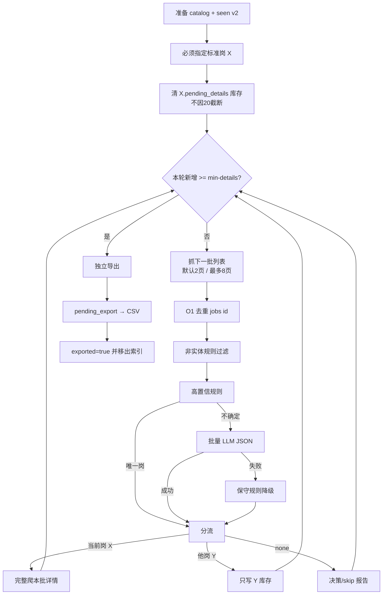

#    BOSS直聘爬虫 · 职位抓取工具 v2.5（Chrome CDP / Skillver CSV）

> 🌐 English documentation: [README.en.md](./README.en.md)

Python
License
Platform
Version

一个轻量的 **BOSS直聘爬虫**：通过 Chrome DevTools Protocol 连接本地已登录的 Chrome，按 **Skillver 标准岗**分步抓取；**标准岗归类由 Agent 内置模型**完成（见 `references/classify-decisions.md`），再开详情并导出 `job_YYYYMMDD.csv`，用 **Agent 网络检索 + 人工确认** 补全 USCC / 工商全称。最小 Agent Skill 见 `SKILL.md`。

> 📌 **一句话介绍**：CDP → 列表 → Agent 归类 → 详情 → Skillver CSV；USCC 靠 Agent 检索与人审，不爬企查查、不在脚本内调 DeepSeek。

cover

---

## ⚠️ 免责声明

本项目仅供学习和技术研究参考，旨在探讨 Chrome DevTools Protocol、前端反爬机制与数据采集技术。请勿用于任何违反 [BOSS直聘用户协议](https://www.zhipin.com/about/protocol.html) 或相关法律法规的用途，不得用于商业转售、恶意爬取或对目标网站造成负担的行为。使用本项目所产生的一切后果由使用者自行承担，作者不对任何滥用行为负责。

---

## 🚀 30 秒快速开始

```bash
# 1. 克隆 + 装依赖
git clone https://github.com/eatmoreduck/boss-zhipin-scraper.git
cd boss-zhipin-scraper
pip install -r requirements.txt          # 或 uv sync

# 2. 启动隔离 Chrome 并登录（只需一次，登录态持久保存）
python3 scripts/boss_cdp_raw.py --setup-chrome

# 3. 标准岗分步（必须 --position-name；完整循环见 SKILL.md）
python3 scripts/boss_cdp_raw.py --position-name "Agent工程师" --drain-inventory
python3 scripts/boss_cdp_raw.py \
  --position-name "Agent工程师" --city 上海 --list-only --list-start-page 1
# Agent 按 references/classify-decisions.md 写出 decisions 后：
python3 scripts/boss_cdp_raw.py \
  --position-name "Agent工程师" \
  --classify-input data/skillver/exports/classify_input_Agent工程师_1.json \
  --details-from-decisions data/skillver/exports/classify_decisions_Agent工程师_1.json

# 4. 导出 Skillver CSV
python3 scripts/export_skillver_csv.py \
  --details data/skillver/details/boss_details_Agent工程师.json \
  --position-name "Agent工程师"

# 查看支持的城市：--list-cities [关键词]
python3 scripts/boss_cdp_raw.py --list-cities 江
```

Agent Skill 完整人机流程（登录闸门 / USCC 检索 / CSV 核验）见 [`SKILL.md`](./SKILL.md)。

## ✨ 特性

- 明文薪资（API 模式，绕过字体反爬）
- Skillver 标准岗主路径（`--position-name` + catalog）
- 详情页 JD 抓取；导出 `job_YYYYMMDD.csv`（含 USCC / 工商全称列）
- USCC：Agent 网络检索 + `company_uscc_cache.json`（人审后写入）
- 增量写入（异常退出不丢数据）
- 一键环境检查 + 持久隔离 Chrome CDP profile
- 多维筛选（规模、融资、薪资、经验、学历、行业）
- macOS / Linux / Windows（Windows 需本机 Chrome + 调试端口）

🔍 为什么不选 Selenium / Playwright 类爬虫？

- Selenium/Playwright 会启动完整的受控浏览器，体积大、指纹明显，容易触发 BOSS 的风控和验证码。
- 本工具直接连接你已经登录的真实 Chrome（CDP），复用真实指纹和登录态，调用的也是页面内合法的搜索 API，返回的 `salaryDesc` 本就是明文——不需要解析被字体反爬加密的 DOM 薪资。
- 因此比传统 DOM 抓取类爬虫更稳定，也更难被识别为自动化流量。


## 安装

### 方式 1：克隆到本地再安装（推荐）

由于 `hermes skills install` 的网络请求在某些环境下可能无法直接访问 GitHub，推荐先克隆仓库再本地安装：

```bash
# 1. 克隆仓库
git clone https://github.com/eatmoreduck/boss-zhipin-scraper.git
cd boss-zhipin-scraper

# 2. 复制到 Hermes skills 目录（最小集）
SKILL_ROOT=~/.hermes/skills/data-science/boss-zhipin-scraper
mkdir -p "$SKILL_ROOT/scripts" "$SKILL_ROOT/data/skillver" "$SKILL_ROOT/references"
cp SKILL.md "$SKILL_ROOT/"
cp requirements.txt "$SKILL_ROOT/"
cp scripts/boss_cdp_raw.py scripts/export_skillver_csv.py "$SKILL_ROOT/scripts/"
cp data/city_codes.json "$SKILL_ROOT/data/"
cp data/skillver/position_catalog.json "$SKILL_ROOT/data/skillver/"
cp references/classify-decisions.md "$SKILL_ROOT/references/"
```

### 方式 2：curl 一键安装

不需要克隆整个仓库，直接下载必要文件：

```bash
SKILL_ROOT=~/.hermes/skills/data-science/boss-zhipin-scraper
mkdir -p "$SKILL_ROOT/scripts" "$SKILL_ROOT/data/skillver" "$SKILL_ROOT/references" && \
curl -sL https://raw.githubusercontent.com/eatmoreduck/boss-zhipin-scraper/master/SKILL.md \
  -o "$SKILL_ROOT/SKILL.md" && \
curl -sL https://raw.githubusercontent.com/eatmoreduck/boss-zhipin-scraper/master/requirements.txt \
  -o "$SKILL_ROOT/requirements.txt" && \
curl -sL https://raw.githubusercontent.com/eatmoreduck/boss-zhipin-scraper/master/scripts/boss_cdp_raw.py \
  -o "$SKILL_ROOT/scripts/boss_cdp_raw.py" && \
curl -sL https://raw.githubusercontent.com/eatmoreduck/boss-zhipin-scraper/master/scripts/export_skillver_csv.py \
  -o "$SKILL_ROOT/scripts/export_skillver_csv.py" && \
curl -sL https://raw.githubusercontent.com/eatmoreduck/boss-zhipin-scraper/master/data/city_codes.json \
  -o "$SKILL_ROOT/data/city_codes.json" && \
curl -sL https://raw.githubusercontent.com/eatmoreduck/boss-zhipin-scraper/master/data/skillver/position_catalog.json \
  -o "$SKILL_ROOT/data/skillver/position_catalog.json" && \
curl -sL https://raw.githubusercontent.com/eatmoreduck/boss-zhipin-scraper/master/references/classify-decisions.md \
  -o "$SKILL_ROOT/references/classify-decisions.md"
```

### 方式 3：hermes skills install（需网络直连 GitHub）

```bash
hermes skills install https://raw.githubusercontent.com/eatmoreduck/boss-zhipin-scraper/master/SKILL.md --category data-science
```

> 注意：此方式依赖 hermes 进程能直接访问 GitHub，如果遇到超时或连接失败，请使用方式 1 或 2。

### 验证安装

```bash
# 检查文件是否存在
ls ~/.hermes/skills/data-science/boss-zhipin-scraper/SKILL.md
ls ~/.hermes/skills/data-science/boss-zhipin-scraper/requirements.txt
ls ~/.hermes/skills/data-science/boss-zhipin-scraper/scripts/boss_cdp_raw.py
ls ~/.hermes/skills/data-science/boss-zhipin-scraper/scripts/export_skillver_csv.py
ls ~/.hermes/skills/data-science/boss-zhipin-scraper/data/city_codes.json
ls ~/.hermes/skills/data-science/boss-zhipin-scraper/data/skillver/position_catalog.json
ls ~/.hermes/skills/data-science/boss-zhipin-scraper/references/classify-decisions.md
```

安装后在 Agent 对话中说「按标准岗抓 BOSS 上海 Agent工程师 并导出 Skillver CSV」（须遵守 `SKILL.md` 人机闸门）。

## 作为命令行工具使用

不想装成 Skill 也可以直接当 CLI 用：

```bash
# 1. 克隆 + 安装依赖
git clone https://github.com/eatmoreduck/boss-zhipin-scraper.git
cd boss-zhipin-scraper
pip install -r requirements.txt

# 2. 启动 Chrome CDP
python3 scripts/boss_cdp_raw.py --setup-chrome
# 首次使用也不会复制主 Chrome 登录态；请在弹出的 BOSS 专用浏览器中登录 zhipin.com
# setup 会等待登录完成，并确认接口能返回明文薪资

# 3. 检查环境
python3 scripts/boss_cdp_raw.py --check

# 可选：真实浏览器/API smoke test（不写结果文件）
python3 scripts/boss_cdp_raw.py --smoke-test

# 4. 按标准岗抓取（必须 --position-name）
python3 scripts/boss_cdp_raw.py \
  --position-name "预训练算法研究员/工程师" \
  --city 上海 --pages 3

# 5. 导出 Skillver CSV
python3 scripts/export_skillver_csv.py \
  --details data/skillver/details/boss_details_预训练算法研究员_工程师.json \
  --position-name "预训练算法研究员/工程师"
```

## 参数


| 参数                                       | 说明                                                                                                                                                                                |
| ---------------------------------------- | --------------------------------------------------------------------------------------------------------------------------------------------------------------------------------- |
| `--position-name`                        | **标准岗主路径（必填）**：须命中 `data/skillver/position_catalog.json`；同时作为 BOSS 搜索词；默认写出 `data/skillver/jobs/` 与 `details/`                                                                 |
| `--catalog`                              | 标准岗 catalog 路径（默认 `data/skillver/position_catalog.json`）                                                                                                                           |
| `--seen`                                 | Skillver `seen_jobs.json`（默认 `data/skillver/seen_jobs.json`；详情成功写 `has_details=true, exported=false`）                                                                              |
| `--keyword`                              | [legacy] 自由搜索词；主路径请用 `--position-name`                                                                                                                                             |
| `--city`                                 | 城市（中文或 9 位代码，默认上海）。**支持全国城市**（一二三四五线全覆盖，共 300+ 个），运行时自动从 BOSS 同步最新城市码；码表见 `[data/city_codes.json](data/city_codes.json)`，或用 `--list-cities` 查看。本地及在线码表均无法识别的城市名会报错退出，避免静默得到 0 条结果 |
| `--list-cities [关键词]`                    | 打印支持的城市列表，可选关键词过滤，如 `--list-cities 江`                                                                                                                                             |
| `--pages`                                | 页数（标准岗模式最多 3；全局上限 10）                                                                                                                                                              |
| `--format`                               | json / csv；csv 会同时导出列表和详情 CSV                                                                                                                                                     |
| `--detail`                               | 抓取详情页 JD（默认开启）；开详情前会先过滤猎头/人力资源中介列表卡片，再应用 `--max-details`（列表 JSON 仍保留原始结果）                                                                                                         |
| `--no-detail`                            | 不抓取详情页                                                                                                                                                                            |
| `--max-details N`                        | 最多抓取 N 条详情（标准岗默认 20；经匹配/实体或猎头过滤，并跳过已抓详情后截取）                                                                                                                                    |
| `--match-report`                         | 标准岗匹配/实体公司跳过报告 JSON（默认 `data/skillver/exports/match_skip_<岗名>.json`）                                                                                                          |
| `--title-include` / `--title-exclude` / `--title-filter-pm` | [legacy] 详情前标题过滤；**标准岗模式下忽略**（改用 LLM/规则匹配）                                                                                                                              |
| `--keywords-file FILE`                   | [legacy] 批内多岗 JSON；**已退出主路径**，请改用 `--position-name`                                                                                                                                |
| `--output-dir DIR`                       | [legacy] 批模式输出目录                                                                                                                                                                   |
| `--position-gap SEC`                     | [legacy] 批内岗间等待                                                                                                                                                                    |
| `--seen-details-dir DIR`                 | 额外扫描已抓详情 JSON 以按 `encrypt_job_id` 去重（标准岗仍以 `seen_jobs.json` 为准）                                                                                                                    |
| `--analysis`                             | 分析报告                                                                                                                                                                              |
| `--merge FILE`                           | 合并已有数据（按 job_id 去重）                                                                                                                                                               |
| `--allow-dom-fallback`                   | API 无数据时允许降级 DOM 提取；默认关闭，薪资可能不可信                                                                                                                                                  |
| `--check`                                | 环境检查（CDP + 依赖 + 登录态）                                                                                                                                                              |
| `--smoke-test`                           | 用真实 Chrome/CDP 跑一次 BOSS 搜索 API smoke test，不写结果文件                                                                                                                                  |
| `--setup-chrome`                         | 一键启动 Chrome CDP（持久隔离 profile）                                                                                                                                                     |
| `--copy-login-state`                     | 手动导入主 Chrome 的 Local State + Cookie 相关文件到隔离 profile（默认、首次启动、重复启动都不复制）                                                                                                             |
| `--reset-chrome-profile`                 | 重建 BOSS 专用 Chrome profile，会清除此专用浏览器内的登录态                                                                                                                                          |
| `--no-wait-login`                        | `--setup-chrome` 启动后不等待登录完成                                                                                                                                                       |
| `--login-timeout`                        | `--setup-chrome` 等待登录完成的秒数（默认 300）                                                                                                                                                |
| `--stop-chrome`                          | 关闭 BOSS 专用 CDP Chrome（按隔离 profile 精准匹配，不碰主 Chrome）                                                                                                                                |
| `--close-chrome`                         | 抓取正常结束后自动关闭专用 Chrome（默认不关；异常退出不触发，保留登录态）                                                                                                                                          |
| `--output`                               | 列表输出路径（默认 `~/.boss-zhipin-scraper/job-result/`）                                                                                                                                   |
| `--detail-output`                        | 详情输出路径（默认 `~/.boss-zhipin-scraper/job-result/`）                                                                                                                                   |
| `--cdp-port`                             | CDP 端口（默认 9222）                                                                                                                                                                   |
| `--scale/--salary/--experience/--degree` | 筛选条件                                                                                                                                                                              |


## Skillver 标准岗流水线

面向 Skillver `job_YYYYMMDD.csv`。Agent 编排见 [`SKILL.md`](./SKILL.md)（人机闸门：登录 / USCC / CSV 核验）。

**2.5.0 主路径**：catalog、导出、seen v2、分步 CLI（drain / list-only / details-from-decisions）、**Agent 内置模型归类**（`references/classify-decisions.md`）、筛选多选。USCC / 工商全称由 **Agent 网络检索 + 人工确认** 写入 cache，并**原地回填 CSV**。`--keywords-file` 为 **legacy**（CLI 已拒绝）。不需要 DeepSeek `.env`。

主链：

```text
清库存
→ 两页列表
→ O(1) 去重
→ 非实体规则过滤
→ 高置信规则分类
→ 批量 LLM
→ 保守规则降级
→ 当前岗详情 / 他岗库存 / none
→ 完成本批详情后决定是否继续
→ 最多八页
→ 独立导出
```

标准岗分步示例（`--min-details` 默认 5、上限 50；完整循环见 `SKILL.md`）：

```bash
python3 scripts/boss_cdp_raw.py --position-name "Agent工程师" --drain-inventory
python3 scripts/boss_cdp_raw.py \
  --position-name "Agent工程师" --city 上海 \
  --list-only --list-start-page 1 --page-batch-size 2 --min-details 5
# Agent 写好 classify_decisions 后：
python3 scripts/boss_cdp_raw.py \
  --position-name "Agent工程师" \
  --classify-input data/skillver/exports/classify_input_Agent工程师_1.json \
  --details-from-decisions data/skillver/exports/classify_decisions_Agent工程师_1.json
```

导出示例（按 `pending_export` 取待导出；岗名三列来自 catalog；默认文件名按当天日期）：

```bash
python3 scripts/export_skillver_csv.py \
  --details data/skillver/details/xxx.json \
  --position-name "预训练算法研究员/工程师" \
  --seen data/skillver/seen_jobs.json \
  --city 上海 \
  --append
# 默认写出 data/skillver/exports/job_YYYYMMDD.csv
```

补全统一社会信用代码 + 工商全称：

1. 导出后列出 CSV 中空缺 USCC 的 `招聘品牌名`
2. 用 **Agent 网络检索**公开信息得到候选 `uscc` / `legal_name`（歧义项人工确认）
3. 写入 `data/skillver/company_uscc_cache.json`（`by_brand` + `by_uscc`；brand key 须与 CSV 一字不差）
4. **原地修改**已有 `job_YYYYMMDD.csv` 回填 `企业名称` / `统一社会信用代码`；`招聘品牌名` 保留 BOSS 展示名

后端应以 **USCC** 为企业唯一键。完整步骤见 `SKILL.md` Step 6–7。

成功写出一行后，会以 `encrypt_job_id` 为键把该岗标为 `exported=true` 并移出 `pending_export`；`--dry-run` 不写 CSV、也不更新 seen。打包安装后也可：`uv run boss-export-skillver --details ...`。

导出侧会适配 Skillver 平台「按逗号拆字段再拼回」的解析：JD 内 ASCII 逗号改为全角 `，`、去掉引号；同一主体（优先 USCC）+ 岗位名称去重；明显 HR/销售错标与薪资低端 `<10K` 会跳过。

### 核心约定

1. **必须指定标准岗**；主资产为 `data/skillver/position_catalog.json`（58 岗）。正式 `position_name` 只能是 catalog 原名。
2. 选定岗 X 后，CSV 三列固定：一级编号 / 一级岗位名称 / 岗位名称；禁止用 BOSS `title` 或 LLM 发明岗名写 CSV。
3. 分步：清库存 → `list-only`（去重 + 猎头/匿名规则）→ **Agent 按 `references/classify-decisions.md` 归类** → `details-from-decisions`（当前岗详情 / 他岗库存 / none）。归类失败重试 3 次后打断点续跑。
4. **`--min-details` 是本轮目标新增详情数**（默认 5，上限 50）：由 Agent 循环控制；单次脚本调用不自动循环翻页归类。
5. 列表默认 **2 页一批**（`--page-batch-size`），标准岗搜索预算 / 硬上限 **8 页**（`--pages`）。
6. 单表 `seen_jobs.json`（version 2）：`jobs` 为唯一真相，`by_position[X].pending_details/pending_export` 为待办索引。他岗 Y 只挂库存。
7. 产出在 `data/skillver/`（`jobs/` / `details/` / `exports/` / USCC 缓存）。
8. 导出为独立脚本；USCC 确认后**原地改 CSV**（已 `exported=true` 的行不会因再 export 自动重写）。

### 标准岗设计表（58）

与 `data/skillver/position_catalog.json` 一致。AI 36 + 机器人 22。

#### AI（36）

| job_intent_id | job_intent_label | position_name |
|---|---|---|
| J01 | AI 算法工程师 | 机器学习工程师 |
| J01 | AI 算法工程师 | CV算法工程师 |
| J01 | AI 算法工程师 | 智能搜索/推荐工程师 |
| J02 | AI 大模型工程师 | 预训练算法研究员/工程师 |
| J02 | AI 大模型工程师 | 后训练与对齐工程师 |
| J02 | AI 大模型工程师 | 推理优化工程师(算法层) |
| J02 | AI 大模型工程师 | 模型架构研究员 |
| J02 | AI 大模型工程师 | 大模型评测与合成数据专家 |
| J03 | AI 应用开发工程师 | AI应用工程师 |
| J03 | AI 应用开发工程师 | Agent工程师 |
| J04 | AI 多模态工程师 | 多模态/AIGC算法工程师 |
| J04 | AI 多模态工程师 | 视频/数字人生成工程师 |
| J04 | AI 多模态工程师 | 语音AI工程师(含合成) |
| J05 | AI 数据工程师 | AI数据工程师(管道/治理) |
| J05 | AI 数据工程师 | AI数据质量工程师 |
| J05 | AI 数据工程师 | AI知识工程师 |
| J06 | AI 基础设施 / MLOps | MLOps/LLMOps工程师 |
| J06 | AI 基础设施 / MLOps | 推理部署工程师(工程层) |
| J06 | AI 基础设施 / MLOps | AI平台工程师 |
| J06 | AI 基础设施 / MLOps | GPU/算力调度工程师 |
| J06 | AI 基础设施 / MLOps | AI数据基建/特征平台 |
| J06 | AI 基础设施 / MLOps | AI成本工程师(FinOps) |
| J08 | AI 安全 / 合规工程师 | AI安全架构师 |
| J08 | AI 安全 / 合规工程师 | 模型安全红队/对抗检测 |
| J08 | AI 安全 / 合规工程师 | AI治理/合规与风险 |
| J09 | AI 产品经理 | AI产品经理(平台/商业) |
| J09 | AI 产品经理 | 对话式/Agent产品经理 |
| J09 | AI 产品经理 | AI业务分析师 |
| J10 | AI 解决方案 / 售前 | AI解决方案架构师 |
| J10 | AI 解决方案 / 售前 | AI售前工程师 |
| J10 | AI 解决方案 / 售前 | AI交付/前向部署工程师 |
| J11 | AI 商业化 / 运营 / 销售 | AI商务拓展经理(含客户成功) |
| J11 | AI 商业化 / 运营 / 销售 | AI增长/市场营销经理 |
| J99 | 其他 / 跨方向 | AI研究员/科学家 |
| J99 | 其他 / 跨方向 | AI技术项目经理 |
| J99 | 其他 / 跨方向 | AI自动化架构师 |

#### 机器人（J07，22）

一律 `job_intent_id=J07`，`job_intent_label=机器人 / 具身智能工程师`：

| position_name |
|---|
| 具身智能算法工程师 |
| 机器人感知算法工程师 |
| 机器人导航规划工程师 |
| 机器人运动控制工程师 |
| 具身智能硬件工程师 |
| 机器人产品经理 |
| 机器人系统架构师 |
| 机器人解决方案工程师 |
| 机器人项目经理 |
| 具身智能研究工程师 |
| 机器人AI产品工程师 |
| 机器人数据工程师 |
| 机器人基础平台工程师 |
| 伺服驱动工程师 |
| 机器人安全系统工程师 |
| 机械臂结构设计工程师 |
| 机器人仿真与迁移工程师 |
| 机器人验证测试工程师 |
| 机器人执行器工程师 |
| 机器人视觉传感器工程师 |
| 灵巧手工程师 |
| 触觉/力觉传感器工程师 |

### 流程图



### 目录

```
data/skillver/
├── position_catalog.json      # 可提交：唯一标准岗资产
├── seen_jobs.json             # 本地：version 2（jobs + by_position）
├── company_uscc_cache.json    # 本地：品牌 ↔ USCC / 工商全称
├── jobs/                      # 本地：列表 JSON
├── details/                   # 本地：详情 JSON
├── exports/                   # 本地：job_YYYYMMDD.csv / 决策报告
├── uscc_screenshots/          # 本地：enrich 可选截图
└── eval/                      # 本地：review_*.csv / gold_labels.jsonl / metrics_*.json
```

### seen 表状态（version 2）

| 状态 | 含义 | 行为 |
| --- | --- | --- |
| 不在 `jobs` | 未见过 | 分类后可写入并进入对应岗 `pending_details` |
| `has_details=false` | 已归类未爬详情 | 在 `by_position[X].pending_details`；跑 X 时优先清库存 |
| `has_details=true` 且 `exported=false` | 已爬未导 | 在 `pending_export`；导出成功后移出 |
| `exported=true` | 已导出 | 不进待办队列；导出跳过 |


## 文件结构

```
boss-zhipin-scraper/
├── SKILL.md                         # 最小 Agent Skill 手册（人机协同）
├── README.md
├── CHANGELOG.md
├── LICENSE
├── pyproject.toml
├── references/classify-decisions.md # Agent 归类决策契约
├── data/
│   ├── city_codes.json              # 全量城市码表
│   └── skillver/                    # 标准岗 catalog + 本地产出 / USCC 缓存
├── scripts/
│   ├── boss_cdp_raw.py              # 抓取主脚本
│   └── export_skillver_csv.py       # 详情 → job_YYYYMMDD.csv + seen / USCC cache
├── tests/
└── requirements.txt
```

## 工作原理

这是一个基于 Chrome CDP 的 BOSS直聘爬虫，核心流程：

1. 通过 Chrome DevTools Protocol (CDP) 连接到已打开的 Chrome
2. 在 BOSS直聘页面内注入 JS，用同步 XHR 调用搜索 API
3. API 返回明文 `salaryDesc`，绕过前端字体反爬
4. 列表 API 保留 `securityId` / `lid` 等上下文，进入详情页时带上这些参数
5. 每页抓完立即写入文件，按 `job_id` 去重

默认不会使用 DOM 提取列表，因为 DOM 薪资可能受字体反爬影响。只有明确传 `--allow-dom-fallback` 时，API 无数据才会降级 DOM。

详情页只从包含“职位描述”的详情区提取 JD，整页 `body` 仅用于识别登录墙和导航页，不会直接写入结果。若页面出现“登录查看完整内容”，抓取会明确报错并停止。标准岗分步：`--drain-inventory` 清库存；`--list-only` 做去重与猎头/匿名规则并写出 `classify_input`；Agent 按契约归类后 `--details-from-decisions` 开当前岗详情、他岗挂库存；`--min-details` 默认 5、上限 50；`--pages` 最多 8 页。去重以 `seen_jobs.json` 的 `jobs[id]` 为主。详情成功后绑定岗名三列并更新 seen（进入 `pending_export`）。

对已抓列表补详情（须带 `--position-name` 以写入绑定 / seen）：

```bash
python3 scripts/boss_cdp_raw.py \
  --position-name "AI产品经理(平台/商业)" \
  --input data/skillver/jobs/boss_jobs_xxx.json \
  --min-details 50 \
  --detail-output data/skillver/details/boss_details_xxx.json
```

批内多岗（**legacy，CLI 已拒绝**；请改用 `--position-name` 逐岗抓取）。

`--input ... --analysis --no-detail` 会优先加载 `--detail-output`，其次加载与输入列表同目录、同时间戳的 `boss_details_*.json`，最后查找 `~/.boss-zhipin-scraper/job-result` 下最新详情文件。

## Chrome profile 安全策略

`--setup-chrome` 默认使用持久隔离 profile，不软链接、不复制你的主 Chrome 数据。首次启动和后续重复启动都只是创建或复用这个专用 profile：

- `~/.boss-zhipin-scraper/chrome-profile`

未显式指定 `--output` / `--detail-output` 时，标准岗主路径默认保存到：

- `data/skillver/jobs/boss_jobs_<岗名>.json`
- `data/skillver/details/boss_details_<岗名>.json`

（非标准岗的其它工具路径仍可能用到 `~/.boss-zhipin-scraper/job-result`。）

首次使用需要在这个专用 Chrome 中手动登录 BOSS直聘。`--setup-chrome` 会等待登录完成，并用搜索接口确认能拿到明文 `salaryDesc` 后再返回。登录态保存在专用 profile 内，重启机器后仍然保留；重复运行 `--setup-chrome` 不会清空它，也不会影响主 Chrome、Gmail、GitHub 等账号。

登录探测每轮只发送一个搜索请求，并在不同关键词/城市之间轮换，等待间隔会从 3 秒逐步退避到最多 15 秒；这些请求同样计入单次 500 次的全局请求预算。未登录、探测样本为空、接口限制和响应异常会分别提示。遇到已确认的限制状态（例如 `code: 31`、`code: 37`「您的环境存在异常」）会立即停止探测，不会继续提示重复登录或密集重试；对未知风控码还会按 message 关键字（环境存在异常、访问频繁、安全校验等）兜底识别为限制状态，避免把「已登录但被风控」误判为登录失败。

`--setup-chrome` 的交互式登录页是唯一会主动置前的临时页面；环境检查、列表/详情抓取和 smoke test 创建的临时标签页都会在后台运行，避免自动流程反复抢占当前窗口。这里的“后台”仅表示不激活标签页，专用 Chrome 仍以有界面模式运行，必要时可以手动打开检查。

如确实需要从主 Chrome 手动导入 BOSS 登录态，可以显式运行：

```bash
python3 scripts/boss_cdp_raw.py --setup-chrome --copy-login-state
```

`--copy-login-state` 每次运行都会覆盖隔离 profile 内对应的 Cookie 相关文件；日常启动不要加这个参数。它只复制 `Local State` 和 `Default/Cookies*`、`Default/Network/Cookies*` 这类 Cookie 数据库相关文件，不复制密码库、历史记录、扩展或完整 profile。需要清空专用浏览器登录态时使用：

```bash
python3 scripts/boss_cdp_raw.py --setup-chrome --reset-chrome-profile
```

### 用完如何收尾

抓取/分析结束后，专用 Chrome 不会自动关闭（默认保留登录态，方便你接着跑下一条抓取）。确认不再使用时，可以手动收尾：

```bash
python3 scripts/boss_cdp_raw.py --stop-chrome
```

`--stop-chrome` 只关闭 scraper 隔离 profile（`--user-data-dir`）对应的 Chrome 进程，**绝不**按端口或进程名去 kill，因此不会误伤你正在用的主 Chrome、Gmail、GitHub 等账号。

如果你希望某次抓取正常结束后就顺手关掉 Chrome，可以加 `--close-chrome`：

```bash
python3 scripts/boss_cdp_raw.py \
  --position-name "预训练算法研究员/工程师" \
  --city 上海 --pages 3 --close-chrome
```

`--close-chrome` 默认不开启；且只在抓取走完的**成功路径**上触发，登录失败、异常退出等情况不会关闭 Chrome，登录态得以保留。

## 📌 TODO

- [ ] 详情页抓取补强 Referer 与请求指纹，进一步降低风控触发概率

## License

MIT

## 友情链接

- [LINUX DO](https://linux.do/) — 真诚、友善、充满活力的技术社区，本项目认可并推荐。

## Star History

[Star History Chart](https://star-history.com/#eatmoreduck/boss-zhipin-scraper&Date)